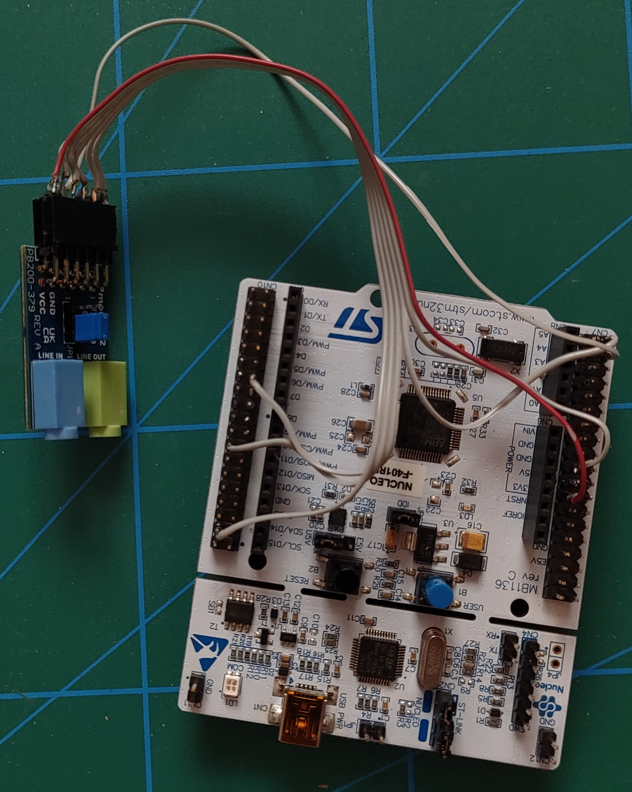
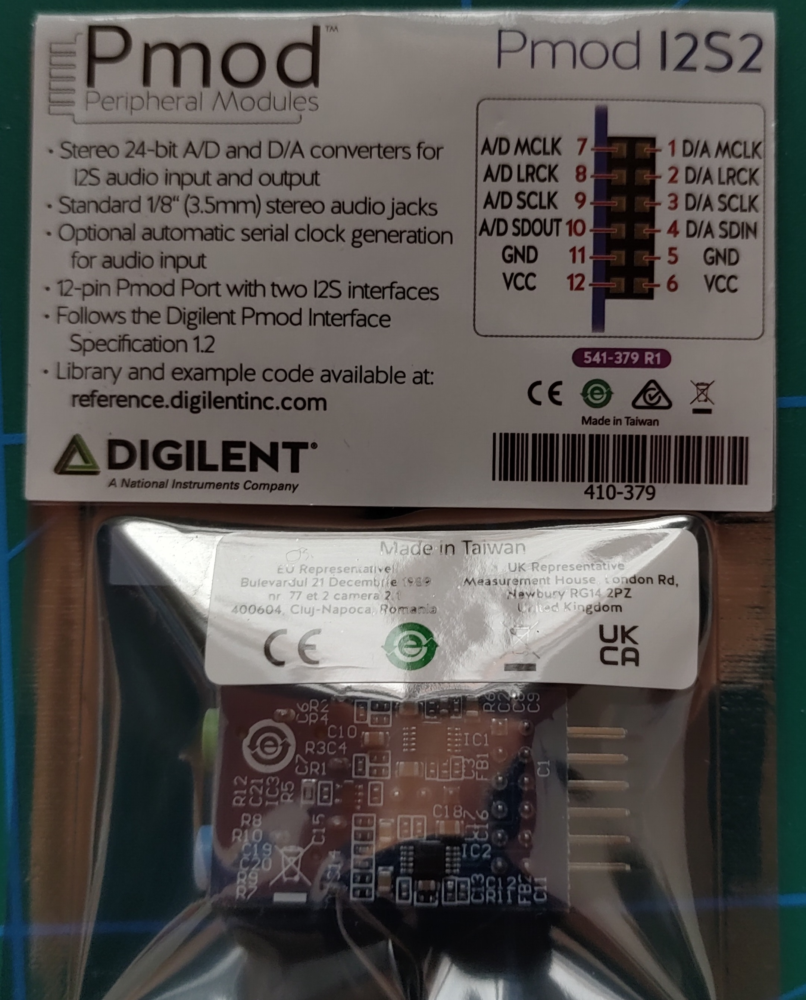
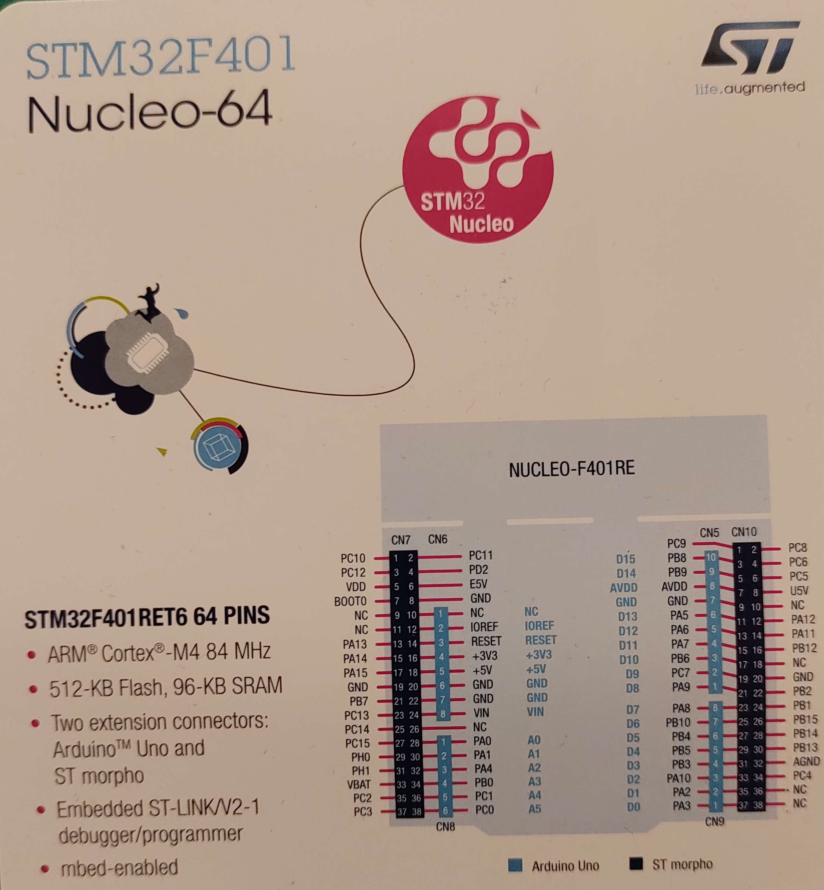

# STM32 Audio DSP

## Hardware

* [I2S2](https://digilent.com/reference/pmod/pmodi2s2/reference-manual)
* [Nucleo-f401re](https://www.st.com/en/evaluation-tools/nucleo-f401re.html)

Connections:
| I2S2  | STM32             |
|-------|-------------------|
| MCLK  | I2S2_MCK (PC6)    |
| LRCK  | I2S2_WS (PB12)    |
| SCLK  | I2S2_CK (PB10)    |
| SDOUT | I2S2_ext_SD (PC3) |
| SDIN  | I2S2_SD (PC3)     |
| GND   | GND               |
| VCC   | 3.3V              |

MCLK, LRCK and SCLK of ADC and DAC are connected in parallel.



### Pinouts



## Software
Basic I2S DMA setup according to [blogpost by AudioDspLab](https://audiodsplab.wordpress.com/ping-pong-buffer-audio-stream).


Audio Configuration:
* 24 bit stereo @ 48kHz, ADC + DAC

```
Hint: STM32CubeMx calls DMA initialization function MX_DMA_Init in the wrong order. DMA will not work unless this is changed manually (Run MX_DMA_Init before MX_I2S2_Init).
```

